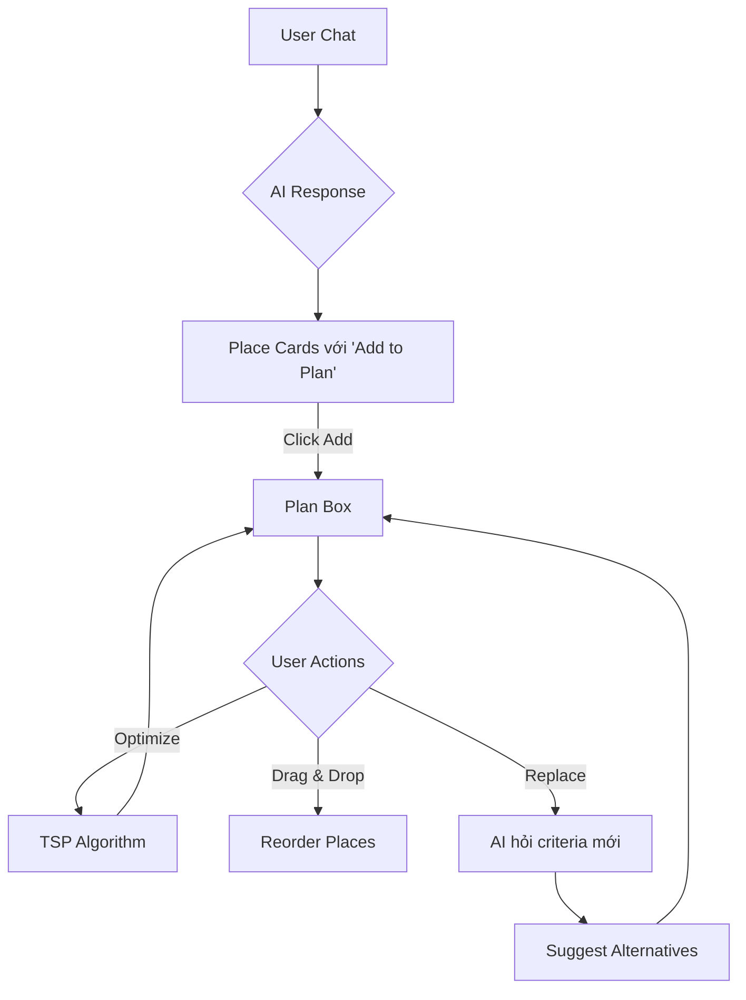
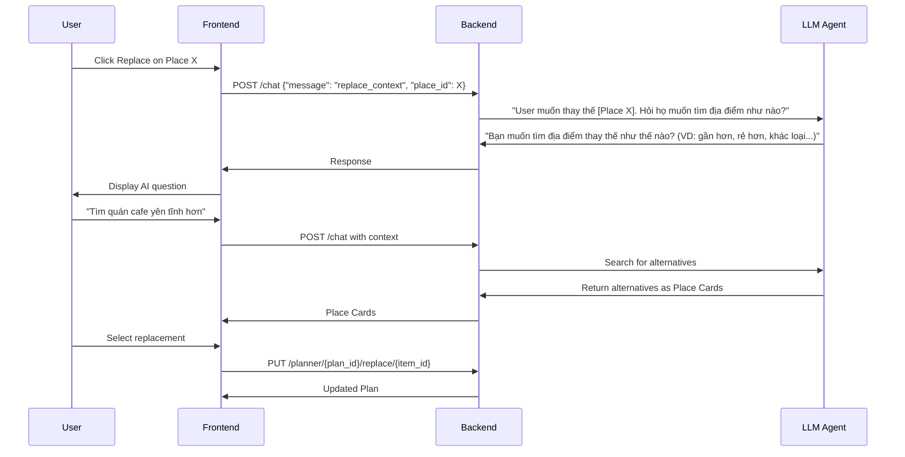

# Trip Planner Feature - Technical Design Document

**Version**: 1.0  
**Date**: 2025-12-15  
**Status**: Draft

---

## 📋 Overview

Tính năng Trip Planner cho phép user lên kế hoạch chuyến đi bằng cách:
1. Chat với AI để tìm địa điểm
2. Thêm địa điểm vào Plan Box
3. Tối ưu lộ trình bằng thuật toán TSP
4. Chỉnh sửa/thay thế địa điểm

---

## 🎯 User Flow



---

## 🏗️ Architecture

### Backend Components

```
app/
├── planner/
│   ├── __init__.py
│   ├── models.py          # Plan, PlanItem schemas
│   ├── router.py          # API endpoints
│   ├── service.py         # Business logic
│   └── tsp.py             # TSP optimization algorithm
└── mcp/tools/
    └── graph_tool.py      # Neo4j + OSM (có sẵn)
```

### API Endpoints

| Method | Endpoint | Description |
|--------|----------|-------------|
| POST | `/planner/create` | Tạo plan mới |
| GET | `/planner/{plan_id}` | Lấy plan |
| POST | `/planner/{plan_id}/add` | Thêm place vào plan |
| DELETE | `/planner/{plan_id}/remove/{item_id}` | Xóa place |
| PUT | `/planner/{plan_id}/reorder` | Sắp xếp lại thứ tự |
| POST | `/planner/{plan_id}/optimize` | Chạy TSP |
| POST | `/planner/{plan_id}/replace/{item_id}` | Thay thế place |

---

## 📦 Data Models

### Plan

```python
@dataclass
class Plan:
    plan_id: str
    user_id: str
    name: str
    items: list[PlanItem]
    created_at: datetime
    updated_at: datetime
    total_distance_km: float | None
    estimated_duration_min: int | None
```

### PlanItem

```python
@dataclass
class PlanItem:
    item_id: str
    place_id: str
    name: str
    category: str
    lat: float
    lng: float
    order: int  # Thứ tự trong plan
    added_at: datetime
    notes: str | None
```

---

## 🧮 TSP Algorithm

### Approach: Nearest Neighbor + 2-opt Optimization

```python
# app/planner/tsp.py

from math import radians, sin, cos, sqrt, atan2

def haversine(lat1, lng1, lat2, lng2) -> float:
    """Calculate distance between 2 points in km."""
    R = 6371  # Earth's radius in km
    dlat = radians(lat2 - lat1)
    dlng = radians(lng2 - lng1)
    a = sin(dlat/2)**2 + cos(radians(lat1)) * cos(radians(lat2)) * sin(dlng/2)**2
    return 2 * R * atan2(sqrt(a), sqrt(1-a))


def calculate_distance_matrix(places: list[dict]) -> list[list[float]]:
    """Build NxN distance matrix."""
    n = len(places)
    matrix = [[0.0] * n for _ in range(n)]
    for i in range(n):
        for j in range(n):
            if i != j:
                matrix[i][j] = haversine(
                    places[i]['lat'], places[i]['lng'],
                    places[j]['lat'], places[j]['lng']
                )
    return matrix


def nearest_neighbor(matrix: list[list[float]], start: int = 0) -> list[int]:
    """Greedy nearest neighbor heuristic."""
    n = len(matrix)
    visited = [False] * n
    tour = [start]
    visited[start] = True
    
    for _ in range(n - 1):
        current = tour[-1]
        nearest = -1
        min_dist = float('inf')
        for j in range(n):
            if not visited[j] and matrix[current][j] < min_dist:
                min_dist = matrix[current][j]
                nearest = j
        tour.append(nearest)
        visited[nearest] = True
    
    return tour


def two_opt(tour: list[int], matrix: list[list[float]]) -> list[int]:
    """2-opt local search improvement."""
    improved = True
    while improved:
        improved = False
        for i in range(1, len(tour) - 1):
            for j in range(i + 1, len(tour)):
                # Calculate improvement
                d1 = matrix[tour[i-1]][tour[i]] + matrix[tour[j-1]][tour[j]]
                d2 = matrix[tour[i-1]][tour[j-1]] + matrix[tour[i]][tour[j]]
                if d2 < d1:
                    # Reverse segment
                    tour[i:j] = tour[i:j][::-1]
                    improved = True
    return tour


def optimize_route(places: list[dict], start_index: int = 0) -> tuple[list[int], float]:
    """
    Main TSP optimization function.
    
    Args:
        places: List of places with 'lat', 'lng' keys
        start_index: Index of starting place
        
    Returns:
        (optimized_order, total_distance_km)
    """
    if len(places) <= 2:
        return list(range(len(places))), 0.0
    
    matrix = calculate_distance_matrix(places)
    tour = nearest_neighbor(matrix, start_index)
    tour = two_opt(tour, matrix)
    
    # Calculate total distance
    total = sum(matrix[tour[i]][tour[i+1]] for i in range(len(tour)-1))
    
    return tour, total
```

### Complexity

- **Nearest Neighbor**: O(n²)
- **2-opt**: O(n²) per iteration, ~O(n³) worst case
- **Suitable for**: Up to ~50 places (typical trip size)

---

## 🔄 Replace Flow

### Workflow



### API Request

```json
// POST /planner/{plan_id}/replace/{item_id}
{
    "new_place_id": "cafe_xyz_123",
    "new_place": {
        "name": "Cafe XYZ",
        "lat": 16.0544,
        "lng": 108.2480,
        "category": "Coffee shop"
    }
}
```

---

## 🎨 Frontend Integration

### Chat Response Format

```json
{
    "response": "Đây là một số quán cafe gần Cầu Rồng:",
    "places": [
        {
            "place_id": "sound_cafe",
            "name": "Sound Cafe",
            "category": "Coffee shop",
            "lat": 16.0611,
            "lng": 108.2272,
            "rating": 4.7,
            "description": "Quán cafe âm nhạc acoustic...",
            "distance_km": 1.75,
            "actions": ["add_to_plan", "view_details"]
        }
    ],
    "plan_context": {
        "plan_id": "plan_abc123",
        "item_count": 3
    }
}
```

### Plan Box State

```typescript
interface PlanState {
    planId: string;
    items: PlanItem[];
    isOptimized: boolean;
    totalDistanceKm: number;
    estimatedDurationMin: number;
}

interface PlanItem {
    itemId: string;
    placeId: string;
    name: string;
    category: string;
    lat: number;
    lng: number;
    order: number;
}
```

---

## 📐 Implementation Plan

### Phase 1: Core API (Week 1)

- [ ] Create `app/planner/` module
- [ ] Implement `models.py` with Pydantic schemas
- [ ] Implement `tsp.py` with optimization algorithm
- [ ] Create `router.py` with basic CRUD endpoints
- [ ] Add session-based plan storage

### Phase 2: Chat Integration (Week 2)

- [ ] Modify chat response format to include `places` array
- [ ] Add `add_to_plan` action handling in agent
- [ ] Implement replace flow with context tracking
- [ ] Store plan context per user session

### Phase 3: TSP & Optimization (Week 3)

- [ ] Implement `/optimize` endpoint
- [ ] Add distance matrix calculation using graph_tool
- [ ] Integrate with Neo4j for real distances (optional: OSRM for road distances)
- [ ] Return optimized order with total distance

### Phase 4: Frontend (Week 4)

- [ ] Create Place Card component with actions
- [ ] Implement Plan Box with drag-drop (react-beautiful-dnd)
- [ ] Add Optimize button with loading state
- [ ] Implement Replace flow UI

---

## 🔧 Technical Considerations

### Storage Options

| Option | Pros | Cons |
|--------|------|------|
| In-memory (Redis) | Fast, simple | Lost on restart |
| Supabase | Persistent, user-linked | Requires auth |
| Session-based | No auth needed | Client-side storage |

**Recommendation**: Start with session-based (in-memory per user_id), migrate to Supabase later.

### Distance Calculation

| Method | Accuracy | Speed |
|--------|----------|-------|
| Haversine | ~95% | Very fast |
| OSRM API | ~99% (road) | Slower |
| Graph (Neo4j) | ~95% | Fast |

**Recommendation**: Use Haversine for MVP, add OSRM for production.

### Rate Limits

- OpenStreetMap Nominatim: 1 req/sec
- OSRM: Self-hosted or 10 req/min (demo server)

---

## 📝 Example Usage

### 1. User Chat

```
User: "Tìm quán cafe và nhà hàng hải sản gần Mỹ Khê"
```

### 2. AI Response with Place Cards

```
AI: "Đây là một số gợi ý cho bạn:

☕ **Cafe**
- [Nia Coffee] - 4.3★ - 1.2km [Add to Plan]
- [Sound Cafe] - 4.7★ - 1.8km [Add to Plan]

🦐 **Hải sản**
- [My Hanh Seafood] - 4.8★ - 0.5km [Add to Plan]
- [Bé Ni 2] - 4.8★ - 0.6km [Add to Plan]
"
```

### 3. Plan Box

```
📍 Your Plan (4 places)
┌──────────────────────────────┐
│ 1. Nia Coffee      [✏️] [🔄] │
│ 2. Sound Cafe      [✏️] [🔄] │
│ 3. My Hanh Seafood [✏️] [🔄] │
│ 4. Bé Ni 2         [✏️] [🔄] │
└──────────────────────────────┘
Total: 8.2km | ~45min

[🔀 Optimize Route] [📤 Export]
```

### 4. After Optimization

```
📍 Your Plan (Optimized ✓)
┌──────────────────────────────┐
│ 1. My Hanh Seafood (start)   │
│ 2. Bé Ni 2         (+0.3km)  │
│ 3. Sound Cafe      (+1.2km)  │
│ 4. Nia Coffee      (+0.8km)  │
└──────────────────────────────┘
Total: 2.3km | ~15min (Saved 5.9km!)
```

---

## 🔗 Related Files

- [`app/mcp/tools/graph_tool.py`](file:///Volumes/WorkSpace/Project/LocalMate/localmate-danang-backend-v2/app/mcp/tools/graph_tool.py) - Existing geocoding/spatial search
- [`app/shared/chat_history.py`](file:///Volumes/WorkSpace/Project/LocalMate/localmate-danang-backend-v2/app/shared/chat_history.py) - Session management
- [`app/agent/mmca_agent.py`](file:///Volumes/WorkSpace/Project/LocalMate/localmate-danang-backend-v2/app/agent/mmca_agent.py) - Chat agent

---

## ✅ Success Metrics

- User can add 5+ places to plan in < 2 minutes
- TSP optimization runs in < 500ms for 20 places
- Replace flow completes in < 3 exchanges with AI
